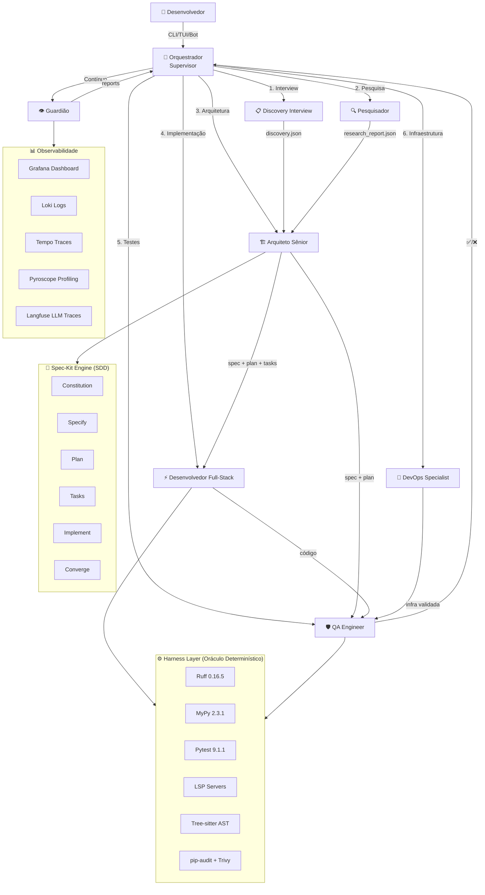

# FLUKSOS-X: Motor Determinístico de Desenvolvimento Guiado por IA — v2 (FINAL)

> **Versão:** 2.0 — Todas as decisões aprovadas, perguntas respondidas, pesquisa finalizada.
> **Data:** 2026-08-29
> **Status:** Pronto para execução

---

## 1. Visão Geral

O **fluksos-x** (`fkx`) é uma CLI multi-agente determinística capaz de desenvolver, melhorar, migrar e manter qualquer sistema de software — independente de linguagem, framework ou stack — com qualidade sênior, usando a tríade **ADD + SDD + TDD** com **Harness Engineering** completo.

**Filosofia central:** O motor é criado usando ele mesmo — especificando, testando, e iterando com determinismo puro desde a primeira linha de código.

---

## 2. Decisões Consolidadas

| # | Decisão | Status |
|---|---------|--------|
| 1 | Motor 100% Python (sem Node.js/TS no core) | ✅ Aprovado |
| 2 | UV Workspaces (monorepo) | ✅ Aprovado |
| 3 | LangGraph como core de orquestração | ✅ Aprovado |
| 4 | LanceDB como vector store local | ✅ Aprovado |
| 5 | CLI isolado por projeto (`.fluksos-x/` + `~/.fkx/`) | ✅ Aprovado |
| 6 | n8n complementar (não core, para projetos gerados) | ✅ Aprovado |
| 7 | Multi-provider via LiteLLM | ✅ Aprovado |
| 8 | Langfuse + Grafana LGTM self-hosted (Docker) | ✅ Aprovado |
| 9 | Licença MIT | ✅ Aprovado |
| 10 | Comando CLI: `fkx` (PyPI: a verificar disponibilidade) | ✅ Aprovado |
| 11 | Autonomia configurável por projeto | ✅ Aprovado |
| 12 | Embeddings locais (sentence-transformers) | ✅ Aprovado |
| 13 | Fluksos (scaffold JS/TS) separado do fluksos-x | ✅ Aprovado |
| 14 | Spec-Kit (GitHub) integrado como engine SDD | ✅ Aprovado |
| 15 | Todas as sugestões bônus incluídas | ✅ Aprovado |

---

## 3. Ambiente Virtual: UV e .venv

> [!NOTE]
> **Resposta à pergunta 2:** Sim, usaremos `.venv`, mas **UV cuida de tudo automaticamente.**
>
> UV cria e gerencia o `.venv` de forma transparente. Você **nunca precisa ativar manualmente** — basta usar `uv run` para executar qualquer comando dentro do ambiente isolado.
>
> ```bash
> uv sync              # Cria .venv + instala tudo (lockfile)
> uv run pytest        # Executa dentro do .venv automaticamente
> uv run fkx dev       # Roda o CLI sem ativar nada
> ```
>
> **Analogia com pnpm:** Sim, UV é para Python o que pnpm é para Node.js — sem duplicação de pacotes (usa hard-links e cache global), lockfile determinístico, e workspaces nativos.

---

## 4. Stack Técnica Pinada (Versões Pesquisadas — 2026-08-29)

> [!IMPORTANT]
> Cada pacote foi pesquisado individualmente. Estas são as versões estáveis mais recentes à data de hoje.

### Core Runtime

| Pacote | Versão Pinada | Notas |
|--------|--------------|-------|
| **Python** | `>=3.12,<3.14` | 3.12+ para performance e tipagem avançada |
| **UV** | `0.12.7` | Package manager + workspace + venv (Astral) |
| **Ruff** | `0.16.5` | Linter + Formatter (substitui flake8+black+isort) |
| **MyPy** | `2.3.1` | Type checker (modo strict) — nova versão 2.x! |
| **Pytest** | `9.1.1` | Test framework (série 9.x estável) |
| **pytest-asyncio** | `latest` | Suporte a testes assíncronos |
| **pytest-cov** | `latest` | Coverage reports |
| **Lefthook** | `2.1.11` | Pre-commit hooks (Go, rápido) |
| **Pydantic** | `2.13.5` | Validação de schemas/configs/estados |
| **Pydantic Settings** | `latest` | Gerenciamento de variáveis de ambiente |

### Orquestração & IA

| Pacote | Versão Pinada | Notas |
|--------|--------------|-------|
| **LangGraph** | `1.2.11` | Grafos de estado, supervisor pattern |
| **LangChain** | `latest` | Base do LangGraph, tools, memory |
| **LiteLLM** | `latest` | Gateway multi-provider (OpenAI-compatible API) |
| **Typer** | `0.27.1` | CLI framework (type-hints) — `typer-cli` deprecated, usar `typer` direto |

### Indexação & Memória

| Pacote | Versão Pinada | Notas |
|--------|--------------|-------|
| **tree-sitter** | `latest` | Parser AST multi-linguagem |
| **LanceDB** | `0.36.0` | Vector DB embeddable (versão estável, não beta) |
| **sentence-transformers** | `latest` | Embeddings locais (~400MB modelo) |

### Interface

| Pacote | Versão Pinada | Notas |
|--------|--------------|-------|
| **Rich** | `15.0.0` | Tabelas, syntax highlight, progress bars |
| **Textual** | `8.2.7` | TUI full-screen, CSS-like styling |

### Observabilidade

| Pacote | Versão Pinada | Notas |
|--------|--------------|-------|
| **opentelemetry-sdk** | `latest` | Telemetria padronizada |
| **opentelemetry-exporter-otlp** | `latest` | Exporter OTLP para Alloy |
| **Langfuse** (SDK Python) | `latest` | Traces de agentes, prompt management |
| **Promptfoo** | `latest` | Avaliação de prompts, red-teaming |
| **Pydantic Logfire** | `latest` | Error tracking (alternativa gratuita a Sentry) |

### Segurança

| Pacote | Versão Pinada | Notas |
|--------|--------------|-------|
| **pip-audit** | `latest` | Auditoria de vulnerabilidades Python (Google/PyPA) |
| **Trivy** | `latest` | Container scanning + IaC scanning |

> [!WARNING]
> **Sobre Snyk:** Snyk é excelente mas é pago para uso avançado. Para nosso caso, `pip-audit` (gratuito, Google/PyPA) + `Trivy` (gratuito, Aqua Security) cobrem 100% das necessidades:
> - `pip-audit` → vulnerabilidades em dependências Python (com `--fix` automático)
> - `Trivy` → vulnerabilidades em containers Docker, IaC, secrets expostos
> - UV já faz hash-pinning nativo no lockfile = supply chain security

---

## 5. Observabilidade Completa do Motor (Docker)

> [!NOTE]
> **Resposta à pergunta 3:** Sim! O motor terá infraestrutura Docker completa para observabilidade com interfaces visuais.

### Stack LGTM + Langfuse (o que cabe para nós)

| Componente | Para quê usamos | Interface Visual |
|-----------|-----------------|------------------|
| **Grafana** | Dashboard central — tudo converge aqui | ✅ `localhost:3000` |
| **Grafana Alloy** | Coletor unificado (substitui Promtail/OTel collector legado) | Não (agent) |
| **Loki** | **Logs** — logs do motor, dos agentes, dos builds | Via Grafana |
| **Tempo** | **Traces** — traces distribuídos dos agentes LangGraph | Via Grafana |
| **Prometheus** | **Métricas** — CPU, RAM, latência, contadores de tokens | Via Grafana |
| **Pyroscope** | **Profiling contínuo** — CPU/Memory bottlenecks do motor | Via Grafana |
| **Langfuse** | **LLM Traces** — raciocínio dos agentes, prompt management, avaliações | ✅ `localhost:3001` |
| **Promptfoo** | **Avaliação de prompts** — red-teaming, testes comparativos | CLI + reports |

### O que NÃO usamos (e porquê)

| Componente | Porquê não |
|-----------|-----------|
| **Mimir** | Para métricas de longa retenção em escala. Prometheus é suficiente para dev/staging |
| **Sentry** | Pago. Pydantic Logfire é gratuito e cobre error tracking |
| **Grafana OnCall** | Overkill para motor solo/pequeno time |

### docker-compose.yml do motor (serviços)

```yaml
services:
  # === DATABASE ===
  postgres:
    image: postgres:17-alpine
    # Estado do LangGraph + Langfuse
  redis:
    image: redis:7-alpine
    # Cache de embeddings, rate limiting, sessões

  # === OBSERVABILIDADE (LGTM) ===
  grafana:
    image: grafana/grafana:latest
    ports: ["3000:3000"]
    # Dashboard central
  alloy:
    image: grafana/alloy:latest
    # Coletor unificado OTel
  loki:
    image: grafana/loki:latest
    # Logs
  tempo:
    image: grafana/tempo:latest
    # Traces
  prometheus:
    image: prom/prometheus:latest
    # Métricas
  pyroscope:
    image: grafana/pyroscope:latest
    # Profiling contínuo

  # === LLM OBSERVABILITY ===
  langfuse:
    image: langfuse/langfuse:latest
    ports: ["3001:3000"]
    # LLM traces + prompt management

  # === LLM GATEWAY ===
  litellm:
    image: ghcr.io/berriai/litellm:latest
    ports: ["4000:4000"]
    # Gateway multi-provider
```

### Docker-Compose: Práticas SÊNIOR de Segurança

```yaml
# Hardening que aplicaremos em CADA serviço:
services:
  postgres:
    image: postgres:17-alpine          # Alpine = menor superfície de ataque
    read_only: true                     # Filesystem read-only
    tmpfs:                              # Diretórios de escrita temporários
      - /tmp
      - /run/postgresql
    security_opt:
      - no-new-privileges:true          # Impede escalação de privilégios
    cap_drop:
      - ALL                             # Remove TODAS as capabilities Linux
    cap_add:
      - CHOWN
      - SETUID
      - SETGID
    deploy:
      resources:
        limits:
          memory: 512M                  # Limite de memória (evita OOM kill)
          cpus: "1.0"                   # Limite de CPU
    healthcheck:                        # Health check obrigatório
      test: ["CMD-SHELL", "pg_isready -U $POSTGRES_USER"]
      interval: 10s
      timeout: 5s
      retries: 5
    networks:
      - internal                        # Rede interna isolada
    # NUNCA expor porta ao host, exceto se necessário

networks:
  internal:
    driver: bridge
    internal: true                      # Sem acesso externo
  proxy:
    driver: bridge                      # Apenas para serviços com porta exposta
```

---

## 6. CLI como Skill para Agentes Externos + Bot Telegram

> [!NOTE]
> **Resposta à pergunta 4:** Sim! A CLI será operável por qualquer agente externo.

### Arquitetura de acesso

```
┌──────────────────────────────────────────┐
│            Formas de usar fkx            │
├──────────────┬───────────────────────────┤
│   HUMANO     │  Terminal direto          │
│              │  fkx dev / fkx spec       │
├──────────────┼───────────────────────────┤
│   AGENTE IA  │  Via constitution/skill   │
│   (IDE)      │  AGENTS.md → orquestrador │
├──────────────┼───────────────────────────┤
│   BOT        │  API programática         │
│   (Telegram) │  fkx-sdk (futuro)         │
├──────────────┼───────────────────────────┤
│   CI/CD      │  fkx run --headless       │
│              │  Modo sem interação        │
└──────────────┴───────────────────────────┘
```

**Como funciona:**
1. A CLI terá um **`AGENTS.md` próprio** que qualquer agente (Antigravity, Claude Code, Copilot, etc.) pode ler como skill/constitution
2. Quando uma IA lê o AGENTS.md do fluksos-x, ela se torna capaz de operar o motor como orquestrador
3. A CLI terá modo **`--headless`** (sem TUI) para uso programático por bots, CI/CD, ou outros agentes
4. **Futuro:** Um `fkx-sdk` Python permitirá integração direta com bots (Telegram, Discord, Slack) — mas isso é pós-MVP

---

## 7. Tooling Detalhado por Agente

> [!NOTE]
> **Resposta à pergunta 5:** Cada agente terá tools específicas, configuráveis via MCP.

| Agente | Tools | Detalhes |
|--------|-------|---------|
| **Orquestrador** | `state_manager`, `task_router`, `human_prompt` | Gerencia estado LangGraph, delega tarefas, solicita input humano |
| **Pesquisador** | `tavily_search`, `crawl4ai_scrape`, `registry_query`, `github_api` | **Tavily** para search (melhor custo-benefício p/ agentes). **Crawl4AI** (open-source, self-hosted) para scraping de docs/páginas. **Registry queries** para NPM/PyPI/Crates. **GitHub API** para releases, issues, discussions |
| **Arquiteto** | `spec_kit_cli`, `ast_query`, `repo_map`, `diagram_gen` | **Spec-Kit** para gerar specs SDD. **AST query** via Tree-sitter. **Repo-map** para visão estrutural. **Mermaid** para diagramas |
| **Desenvolvedor** | `file_write`, `shell_exec`, `lsp_bridge`, `git_ops`, `code_search` | Escrita de arquivos, execução de comandos (sandboxed), bridge LSP, operações git, busca semântica no código |
| **QA Engineer** | `test_runner`, `coverage_report`, `security_scan`, `lint_check`, `type_check` | **pytest/vitest** runner, cobertura, **pip-audit/Trivy** para security, **Ruff** lint, **MyPy** types |
| **DevOps** | `docker_compose`, `k8s_manifest`, `ci_pipeline`, `infra_validate` | Gerar/validar Docker, K8s, GitHub Actions, validação estática (kubeval) |
| **Guardião** | `trace_analyzer`, `dependency_audit`, `perf_report`, `changelog_monitor` | Analisa traces Langfuse, audita deps com pip-audit, gera reports de performance, monitora changelogs upstream |

### Configuração de Search Tools

```toml
# ~/.fkx/config.toml (ou .fluksos-x/config.toml por projeto)

[tools.search]
provider = "tavily"          # tavily | exa | brave | linkup
api_key_env = "TAVILY_API_KEY"

[tools.scraper]
provider = "crawl4ai"        # crawl4ai (self-hosted) | firecrawl (API)
# Crawl4AI é gratuito e local — preferimos para não ter custo

[tools.registry]
npm = true
pypi = true
crates = true
```

---

## 8. Memória: Isolamento por Projeto + Motor Global

> [!NOTE]
> **Resposta à pergunta 6:** Sim, dual! Memória isolada por projeto + memória global do motor.

```
~/.fkx/                                   # 🌍 GLOBAL (do motor)
├── config.toml                           # Configurações globais
├── themes/                               # Temas customizados
├── skills/                               # Skills globais
├── memory/                               # 🧠 Memória global do motor
│   ├── learnings.db                      # O que o motor aprendeu (erros comuns, padrões)
│   ├── best_practices.db                 # Best practices descobertas
│   ├── changelog_tracking.json           # Changelogs de deps monitorados
│   └── self_improvement_log.md           # Log de auto-melhorias
└── cache/                                # Cache de embeddings, modelos

projeto-x/.fluksos-x/                     # 📦 LOCAL (do projeto — isolado)
├── constitution.md                       # AGENTS.md deste projeto
├── specs/                                # Especificações SDD
├── plans/                                # Planos aprovados
├── tasks/                                # Tarefas Kanban
├── .shadow/                              # Shadow memory (por arquivo)
├── index.db                              # Knowledge graph SQLite
├── vectors.lance/                        # LanceDB (embeddings do projeto)
├── config.toml                           # Config local (override do global)
├── sessions/                             # Histórico de sessões
└── reports/                              # Relatórios de QA, auditorias
```

### O motor se auto-melhora?

**Sim, via Agente Guardião:**
- **Learnings:** Quando um padrão de erro se repete (ex: "sempre falha ao gerar migrations Drizzle sem schema completo"), o Guardião registra em `learnings.db` e atualiza skills relevantes
- **Best Practices:** Pesquisador descobre uma nova best practice → Guardião valida → registra globalmente
- **Auto-update:** Guardião monitora changelogs de dependências e alerta quando algo precisa ser atualizado
- **Feedback loop:** Traces de Langfuse alimentam análise do Guardião — ele identifica onde agentes perdem mais tempo/tokens

---

## 9. Discovery Interview (Entrevista de Contexto Humano)

> [!NOTE]
> **Resposta à pergunta 7:** Sim! Integramos como comando `fkx interview` — fase obrigatória antes de qualquer spec.

### Fluxo de Discovery Interview

```bash
fkx interview                 # Modo interativo (TUI)
fkx interview --export json   # Exporta para JSON (uso programático)
```

**Perguntas do fluxo (inspiradas no B.L.A.S.T. do seu AGENTS-EXAMPLE.md):**

| # | Pergunta | Objetivo |
|---|----------|---------|
| 1 | **O que é o projeto?** Descreva em 2-3 frases | Contexto geral |
| 2 | **Para quem serve?** Quem é o usuário final? | Persona / público-alvo |
| 3 | **Quais dores resolve?** Problemas específicos | Proposta de valor |
| 4 | **Tem concorrentes ou inspirações?** URLs, screenshots | Referências de mercado |
| 5 | **North Star:** Qual o resultado singular desejado? | Métrica de sucesso |
| 6 | **Stack preferida?** Ou deixar o motor decidir? | Restrições técnicas |
| 7 | **Integrações externas?** APIs, serviços, bancos | Dependências |
| 8 | **Restrições?** Orçamento, timeline, compliance | Limites |
| 9 | **Deploy target?** Cloud, self-hosted, edge, mobile | Infraestrutura |
| 10 | **Behavioral Rules?** Como o sistema deve "agir"? | Tom, lógica de negócio |

**Output:** Gera um arquivo `discovery.json` + `discovery.md` na pasta `.fluksos-x/` que alimenta a **Constitution** e as **Specs** subsequentes.

**Integração no ciclo determinístico:**
```
INTERVIEW → CONSTITUTION → RESEARCH → SPEC → PLAN → TESTS → IMPLEMENT → HARNESS → QA
```

---

## 10. Integração com Spec-Kit (GitHub)

> [!NOTE]
> **Resposta à pergunta 9:** Sim! Usaremos Spec-Kit como engine SDD nativa do fluksos-x.

### Spec-Kit no fluxo do fluksos-x

O Spec-Kit (132k ⭐, v1.0.0) é o padrão da indústria para SDD. Em vez de criar nosso próprio spec engine do zero, **integramos o Spec-Kit nativamente** e adicionamos nossa camada de automação por cima:

```bash
# Instalação (já vem com UV)
uv tool install specify-cli --from git+https://github.com/github/spec-kit.git@v1.0.0

# Uso dentro do fluksos-x (cada fase do bootstrap usa specify):
fkx spec create          # → internamente chama specify (speckit-specify)
fkx spec plan            # → internamente chama specify (speckit-plan)
fkx spec tasks           # → internamente chama specify (speckit-tasks)
fkx spec implement       # → internamente chama specify (speckit-implement)
fkx spec converge        # → internamente chama specify (speckit-converge)
fkx spec assess <idea>   # → internamente chama specify (assess extension)
fkx spec bug <report>    # → internamente chama specify (bug extension)
```

### Como o specify é usado em CADA fase do bootstrap

> [!IMPORTANT]
> **Resposta à sua pergunta sobre as fases:** Sim! Cada item de cada fase passa pelo ciclo completo do Spec-Kit antes de ser implementado. "Configurar Ruff" não é simplesmente copiar um arquivo — é especificar, pesquisar, planejar, testar, implementar.

**Exemplo: Fase 0 — "Configurar Ruff"**

```
1. RESEARCH (Pesquisador)
   - Qual a versão mais recente do Ruff? → 0.16.5
   - Quais regras SÊNIOR ativar? (isort, pydocstyle, pyupgrade, bandit, etc.)
   - Qual a forma correta de configurar no pyproject.toml vs ruff.toml?
   - Existe integração com UV workspaces?
   - Quais regras conflitam com MyPy strict?

2. SPEC (Arquiteto via Specify)
   specify → speckit-specify
   "Configurar Ruff 0.16.5 como linter e formatter único do monorepo..."
   
3. PLAN (Arquiteto via Specify)
   specify → speckit-plan
   - Criar ruff.toml na raiz do workspace
   - Ativar rule sets: E, F, W, I, UP, S, B, A, C4, ...
   - Configurar per-file overrides para tests/
   - Integrar com lefthook pre-commit
   - Garantir compatibilidade com MyPy
   
4. TASKS (via Specify)
   specify → speckit-tasks
   - [ ] Criar ruff.toml com configuração completa
   - [ ] Adicionar ruff check + ruff format ao lefthook.yml
   - [ ] Escrever teste que valida que ruff check passa em código limpo
   - [ ] Escrever teste que valida que ruff detecta violação conhecida
   
5. TESTS FIRST (QA — TDD)
   - test_ruff_config_exists()
   - test_ruff_check_passes_clean_code()
   - test_ruff_detects_known_violation()
   
6. IMPLEMENT (Dev)
   - Escrever ruff.toml
   - Escrever lefthook.yml
   
7. CONVERGE
   specify → speckit-converge → Converged ✅
```

**Exemplo: Fase 0 — "Configurar docker-compose"**

```
1. RESEARCH (Pesquisador)
   - Docker Compose v2 vs v1 (v1 é legado!)
   - Quais imagens Alpine usar? (postgres:17-alpine, redis:7-alpine)
   - Security hardening: read_only, cap_drop ALL, no-new-privileges
   - Healthchecks obrigatórios para cada serviço
   - Rede interna isolada vs proxy network
   - Named volumes vs bind mounts (para persistência)
   - .env + env_file vs environment direto
   - Limite de recursos (memory, cpus)
   - Secrets management (Docker secrets vs .env)
   - Como NÃO expor portas desnecessariamente
   
2. SPEC → 3. PLAN → 4. TASKS → 5. TESTS → 6. IMPLEMENT → 7. CONVERGE
```

---

## 11. LLM Multi-Provider via LiteLLM

> [!NOTE]
> **Resposta Open Question 1:** Multi-provider via LiteLLM como gateway unificado.

### Providers suportados

| Provider | Modelo(s) | Uso Recomendado |
|----------|----------|-----------------|
| **Anthropic** | Claude Opus, Sonnet, Haiku | Planning (Opus), Implementation (Sonnet), Bulk (Haiku) |
| **OpenAI** | GPT-4o, GPT-4o-mini | Planning, Code generation |
| **Google** | Gemini Pro, Gemini Flash | Research, Long-context analysis |
| **xAI** | Grok | Alternative reasoning |
| **Mistral** | Mistral Large, Codestral | Code-specific tasks |
| **OpenRouter** | Qualquer modelo | Fallback / acesso a modelos menores |
| **Ollama** | Modelos locais (Llama, etc.) | Offline, privacy-sensitive |
| **Vertex AI** | Gemini via Google Cloud | Enterprise / compliance |

### Configuração

```toml
# .fluksos-x/config.toml

[llm]
default_provider = "anthropic"
default_model = "claude-sonnet-4"

[llm.routing]
# Model routing: modelo pesado para planning, leve para implementation
planning = "anthropic/claude-opus-4"
implementation = "anthropic/claude-sonnet-4"
bulk_tasks = "anthropic/claude-haiku"
research = "google/gemini-2.5-pro"

[llm.fallback]
# Se o provider principal falhar, usa o fallback automaticamente
enabled = true
order = ["openai/gpt-4o", "google/gemini-2.5-pro"]

[llm.litellm]
# LiteLLM proxy roda no docker-compose
proxy_url = "http://localhost:4000"
```

---

## 12. Autonomia Configurável

> [!NOTE]
> **Resposta Open Question 5:** Autonomia como configuração por projeto.

```toml
# .fluksos-x/config.toml

[autonomy]
# full-auto | semi-auto | manual
level = "semi-auto"

# Detalhamento por ação:
[autonomy.actions]
file_create = "auto"           # Criar arquivos: auto sem perguntar
file_modify = "auto"           # Modificar arquivos: auto sem perguntar
file_delete = "confirm"        # Deletar: pede confirmação
shell_exec = "confirm"         # Executar comandos: pede confirmação
git_commit = "auto"            # Commits: auto
git_push = "confirm"           # Push: pede confirmação
docker_ops = "confirm"         # Operações Docker: pede confirmação
destructive_ops = "confirm"    # Operações destrutivas: SEMPRE pede
```

**Níveis pré-definidos:**
- **`full-auto`** — Executa tudo sem perguntar (para devs experientes ou CI/CD)
- **`semi-auto`** — Auto para a maioria, confirma para ações destrutivas (RECOMENDADO)
- **`manual`** — Pergunta em cada passo (para aprendizado ou projetos críticos)

---

## 13. Embeddings: O que realmente precisamos

> [!NOTE]
> **Resposta Open Question 6:** Embeddings locais para o motor. Não precisamos de AnythingLLM.

**O que são embeddings no contexto do motor:**
- Vetores numéricos que representam semanticamente código, docs, e specs
- Usados para **busca semântica** ("encontre todo código que lida com autenticação")
- Usados para **RAG** (alimentar o LLM com contexto relevante)

**Modelo local:** `sentence-transformers/all-MiniLM-L6-v2` (~80MB) ou `BAAI/bge-small-en-v1.5` (~130MB)
- Roda no CPU (não precisa de GPU)
- Gratuito, offline, privado
- Suficiente para busca semântica em codebases

**AnythingLLM** é um wrapper visual para RAG — nós construímos nossa própria pipeline RAG (mais controle, determinismo). O AnythingLLM seria redundante.

---

## 14. Arquitetura Completa do Time de Agentes



### Ciclo Determinístico Completo

```
INTERVIEW → CONSTITUTION → RESEARCH → SPEC → PLAN → TASKS → TESTS FIRST → IMPLEMENT → HARNESS → QA → DEVOPS → COMMIT → CONVERGE → REPORT
     ↑                                                                                    ↓
     └────────────────────────────────────────── REJECT (loop) ────────────────────────────┘
```

---

## 15. Estrutura de Diretórios Final

```
fluksos-x/
├── pyproject.toml                        # UV workspace root (virtual)
├── uv.lock                              # Lockfile unificado
├── docker-compose.yml                    # Postgres + Redis + LGTM + Langfuse + LiteLLM
├── docker-compose.dev.yml                # Overrides para dev
├── Dockerfile                            # Imagem para distribuição
├── lefthook.yml                          # Pre-commit: ruff + mypy + pytest + pip-audit
├── ruff.toml                             # Ruff config (linter + formatter)
├── mypy.ini                              # MyPy strict
├── .env.example                          # Template de env vars
├── .gitignore
├── LICENSE                               # MIT
├── README.md
├── AGENTS.md                             # Constitution do PRÓPRIO motor
├── CHANGELOG.md
├── CONTRIBUTING.md
│
├── packages/
│   ├── core/                             # 🧬 Kernel do Motor
│   │   ├── pyproject.toml
│   │   └── src/fkx_core/
│   │       ├── config.py                 # Pydantic Settings
│   │       ├── state.py                  # TypedDict estado LangGraph
│   │       ├── harness.py                # Feedforward + Feedback controls
│   │       ├── constitution.py           # Parser AGENTS.md
│   │       ├── spec_kit_bridge.py        # Bridge com Spec-Kit CLI
│   │       ├── context.py                # Context engineering (budget, relevance)
│   │       ├── models.py                 # Pydantic models
│   │       └── exceptions.py
│   │
│   ├── agents/                           # 🤖 Time de Agentes
│   │   ├── pyproject.toml
│   │   └── src/fkx_agents/
│   │       ├── graph.py                  # Compilação LangGraph
│   │       ├── supervisor.py             # Orquestrador
│   │       ├── researcher.py             # Pesquisador (Tavily + Crawl4AI)
│   │       ├── architect.py              # Arquiteto Sênior (Spec-Kit)
│   │       ├── developer.py              # Desenvolvedor Full-Stack
│   │       ├── qa.py                     # QA Engineer
│   │       ├── devops.py                 # DevOps Specialist
│   │       ├── guardian.py               # Guardião
│   │       └── tools/                    # MCP Tools
│   │           ├── filesystem.py
│   │           ├── shell.py              # Sandboxed execution
│   │           ├── git.py
│   │           ├── web_search.py         # Tavily/Exa
│   │           ├── web_scraper.py        # Crawl4AI
│   │           ├── registry.py           # NPM/PyPI/Crates
│   │           ├── lsp_bridge.py
│   │           └── spec_kit.py           # Specify CLI wrapper
│   │
│   ├── indexer/                          # 🔍 Indexação
│   │   ├── pyproject.toml
│   │   └── src/fkx_indexer/
│   │       ├── treesitter.py
│   │       ├── repo_map.py
│   │       ├── graph_db.py               # SQLite knowledge graph
│   │       ├── call_graph.py
│   │       └── watcher.py                # File watcher incremental
│   │
│   ├── memory/                           # 🧠 Memória
│   │   ├── pyproject.toml
│   │   └── src/fkx_memory/
│   │       ├── shadow.py                 # .shadow/ filesystem
│   │       ├── embeddings.py             # sentence-transformers local
│   │       ├── vectorstore.py            # LanceDB interface
│   │       ├── rag.py                    # RAG pipeline híbrido
│   │       └── global_memory.py          # Memória global do motor
│   │
│   ├── cli/                              # 💻 Interface
│   │   ├── pyproject.toml
│   │   └── src/fkx_cli/
│   │       ├── main.py                   # Entry point (Typer)
│   │       ├── commands/
│   │       │   ├── init.py               # fkx init [--legacy]
│   │       │   ├── dev.py                # fkx dev (sessão interativa)
│   │       │   ├── interview.py          # fkx interview
│   │       │   ├── spec.py               # fkx spec (bridge Spec-Kit)
│   │       │   ├── run.py                # fkx run <task>
│   │       │   ├── audit.py              # fkx audit (legado)
│   │       │   ├── status.py             # fkx status
│   │       │   ├── config.py             # fkx config
│   │       │   ├── doctor.py             # fkx doctor
│   │       │   ├── benchmark.py          # fkx benchmark
│   │       │   └── guardian.py           # fkx guardian report
│   │       ├── tui/                      # Textual full-screen
│   │       │   ├── app.py
│   │       │   ├── screens/
│   │       │   └── widgets/
│   │       ├── themes/
│   │       │   ├── dark.toml
│   │       │   ├── light.toml
│   │       │   ├── matrix.toml
│   │       │   ├── cyberpunk.toml
│   │       │   └── ocean.toml
│   │       └── display.py                # Rich formatters
│   │
│   ├── observability/                    # 📊 Observabilidade
│   │   ├── pyproject.toml
│   │   └── src/fkx_observability/
│   │       ├── tracer.py                 # OTel + GenAI semantics
│   │       ├── langfuse_client.py
│   │       ├── promptfoo_runner.py
│   │       ├── metrics.py                # Prometheus exporter
│   │       └── dashboards/               # Grafana JSON provisioning
│   │
│   └── guardian/                         # 👁️ Guardião
│       ├── pyproject.toml
│       └── src/fkx_guardian/
│           ├── health_check.py
│           ├── dependency_audit.py       # pip-audit integration
│           ├── performance_report.py
│           ├── self_improve.py
│           └── changelog_monitor.py
│
├── skills/                               # 📚 Skills carregáveis
│   ├── README.md                         # Índice
│   ├── react/
│   ├── python-fastapi/
│   ├── nestjs/
│   ├── docker-k8s/
│   ├── database-postgres/
│   ├── security/
│   └── ...
│
├── templates/                            # 📋 Templates
│   ├── constitution/
│   ├── specs/
│   └── interview/
│
├── tests/                                # 🧪 Testes
│   ├── conftest.py
│   ├── unit/
│   ├── integration/
│   └── e2e/
│
├── docs/                                 # 📖 Documentação
│   ├── tree.md                           # Mapa do projeto (para IA)
│   ├── architecture/                     # ADRs
│   ├── guides/
│   └── research/                         # Pesquisas (harness, etc.)
│
├── docker/                               # 🐳 Docker configs
│   ├── postgres/init.sql
│   ├── langfuse/
│   ├── grafana/
│   │   ├── provisioning/
│   │   └── dashboards/
│   ├── alloy/config.alloy
│   ├── prometheus/prometheus.yml
│   ├── loki/loki-config.yml
│   ├── tempo/tempo-config.yml
│   └── litellm/config.yaml
│
└── scripts/                              # 🔧 Scripts auxiliares
    ├── setup.sh
    ├── dev.sh
    ├── test.sh
    └── audit.sh
```

---

## 16. Sugestões Bônus (Todas Inclusas)

| # | Feature | Comando | Status |
|---|---------|---------|--------|
| 1 | **Doctor** — verifica saúde do ambiente | `fkx doctor` | MVP |
| 2 | **Replay** — gravar e replay sessões | `fkx replay` | Pós-MVP |
| 3 | **Plugin System** — skills publicáveis | `fkx plugin add <name>` | Pós-MVP |
| 4 | **Benchmark** — benchmark contra tarefas padrão | `fkx benchmark` | Pós-MVP |
| 5 | **A2A Protocol** — interoperabilidade com outros agents | Configuração | Pós-MVP |
| 6 | **Context Snapshot** — `.context.json` pré-sessão | Automático no `fkx dev` | MVP |
| 7 | **Discovery Interview** — entrevista de contexto | `fkx interview` | MVP |
| 8 | **Tree Doc** — mapa da árvore para IA | `docs/tree.md` | MVP |

---

## 17. Plano de Execução com Specify (Bootstrap Faseado)

> [!IMPORTANT]
> Cada sub-item de cada fase será especificado com o ciclo completo do Spec-Kit (Research → Spec → Plan → Tasks → Tests → Implement → Converge) antes de ser implementado.

### Fase 0: Fundação (3-5 dias)
> *Manualmente com SDD + TDD rigoroso. Cada item passa pelo specify.*

| # | Item | Specify Cycle | Pesquisa Prévia Necessária |
|---|------|-------------|---------------------------|
| 0.1 | Inicializar UV workspace monorepo | ✅ | UV workspaces best practices, pyproject.toml virtual workspace |
| 0.2 | Configurar Ruff 0.16.5 | ✅ | Quais rule sets sênior? ruff.toml vs pyproject.toml? |
| 0.3 | Configurar MyPy 2.3.1 strict | ✅ | Novidades do MyPy 2.x, strict flags, per-module overrides |
| 0.4 | Configurar Pytest 9.1.1 | ✅ | conftest.py patterns, fixtures, markers, asyncio setup |
| 0.5 | Configurar Lefthook 2.1.11 | ✅ | pre-commit config, parallel execution, skip patterns |
| 0.6 | Criar `packages/core/` (config, state, models, exceptions) | ✅ | Pydantic Settings patterns, TypedDict vs dataclass |
| 0.7 | Criar `packages/cli/` (entry point, --help, --version) | ✅ | Typer 0.27.1 patterns, Rich integration |
| 0.8 | Configurar docker-compose (Postgres + Redis) | ✅ | Security hardening, healthchecks, networks, resource limits |
| 0.9 | Git init + branching strategy | ✅ | Conventional Commits, branch naming, .gitignore |
| 0.10 | Criar docs/tree.md | ✅ | Formato do mapa para IA, atualização automática |
| 0.11 | Criar AGENTS.md (constitution base) | ✅ | Spec-Kit constitution format, invariantes |
| 0.12 | Setup pip-audit + Trivy | ✅ | CI integration, baseline scan |

#### Emenda 1 — Integração contínua e automação de release (2026-08-30)

> **Origem**: auditoria executada durante o item `002`, registrada em **ADR-009**.
> O plano original entrega ao motor a capacidade de **gerar** pipelines para os
> sistemas-alvo (agente DevOps, item 3.7) e **não dá pipeline ao próprio motor**.
> Todo o enforcement de qualidade era hook local — e hook local é conveniência,
> não portão: `git commit --no-verify` o desfaz por completo.
>
> Os quatro itens abaixo são **acrescentados à Fase 0**. Não substituem nem
> reordenam nenhum item de 0.1 a 0.12.

| # | Item | Specify Cycle | Pesquisa Prévia Necessária |
|---|------|-------------|---------------------------|
| 0.13 | **CI mínimo** — workflow que executa o harness da Fase 0 em runner limpo | ✅ | Sintaxe de workflow, runners, cache; determinismo entre máquina local e runner |
| 0.14 | **CI completo + branch protection** — Ruff, MyPy, Pytest, pip-audit, gitleaks, portão de cobertura, matriz de versões de Python, `uv sync --frozen`, validação de mensagem de commit | ✅ | Required status checks, rulesets, `uv` em CI, limiar de cobertura, matriz suportada |
| 0.15 | **Automação de release** — `python-semantic-release`, CHANGELOG, tag, build, publicação no PyPI via **trusted publishing (OIDC)**, SBOM anexado ao release | ✅ | Trusted publishing, ambientes protegidos, `cyclonedx-py`, versionamento a partir de Conventional Commits |
| 0.16 | **Atualização automática de dependências** — Renovate ou Dependabot, com agrupamento e harness verde obrigatório no merge | ✅ | Agrupamento de atualizações, política de automerge, interação com o lockfile |

**Ordem de execução acordada** (ver **ADR-011**, que fixa o mapa vigente de 16
posições): `0.13` é executado **imediatamente após** o item `0.11`, antes de todos
os demais. Os outros três seguem a ordem de dependência:

- `0.14` depois de `0.5` — precisa das ferramentas de qualidade existindo;
- `0.15` depois de `0.14` **e de `0.7`** — não se publica no PyPI um pacote que
  ainda não existe;
- `0.16` depois de `0.15` — precisa do pipeline completo para validar o que entra.

**Razão da inserção antecipada de `0.13`**: o harness cresce por acréscimo desde o
item `001`, e a integração contínua precisa crescer junto. Um CI que só chega no
fim da Fase 0 significa que dez itens foram construídos sem rede — e que a
primeira execução do pipeline terá de validar dez itens de uma vez, em vez de um.
O CI mínimo depende apenas de shell, git e Python, que já existem.

### Fase 1: Harness & Indexação (4-6 dias)

| # | Item | Pesquisa Prévia |
|---|------|----------------|
| 1.1 | `core/harness.py` — feedforward + feedback controls | Harness Engineering patterns, exit codes |
| 1.2 | `core/constitution.py` — parser AGENTS.md | Spec-Kit format parsing |
| 1.3 | `core/spec_kit_bridge.py` — bridge com Spec-Kit CLI | Specify CLI API, invocação programática |
| 1.4 | `indexer/treesitter.py` — AST parser multi-linguagem | tree-sitter Python bindings, grammars |
| 1.5 | `indexer/repo_map.py` — gerador de repo-map | Aider repo-map format, conciseness |
| 1.6 | `indexer/graph_db.py` — knowledge graph SQLite | Schema design, query patterns |
| 1.7 | `indexer/watcher.py` — file watcher incremental | watchdog vs inotify, SHA-256 hashing |
| 1.8 | LSP bridge básico | typescript-language-server, pyright, gopls |

### Fase 2: Agentes Core (5-7 dias)

| # | Item | Pesquisa Prévia |
|---|------|----------------|
| 2.1 | `agents/graph.py` — compilação LangGraph | StateGraph API, checkpointing |
| 2.2 | `agents/supervisor.py` — Orquestrador | Tool-calling pattern, state routing |
| 2.3 | `agents/architect.py` — Arquiteto (Spec-Kit integration) | Spec-Kit programmatic usage |
| 2.4 | `agents/developer.py` — Developer | Code generation patterns, sandbox |
| 2.5 | `agents/qa.py` — QA (TDD) | Test generation, coverage analysis |
| 2.6 | `agents/tools/*` — todas as tools MCP | MCP server patterns, tool schemas |
| 2.7 | PostgresSaver setup | LangGraph persistence, migrations |
| 2.8 | Harness integration no ciclo do agente | Loop determinístico, exit conditions |

### Fase 3: Memória & Observabilidade (3-5 dias)

| # | Item | Pesquisa Prévia |
|---|------|----------------|
| 3.1 | `memory/shadow.py` + `embeddings.py` + `vectorstore.py` | Shadow memory pattern, LanceDB API |
| 3.2 | `memory/rag.py` — RAG pipeline híbrido | AST + Vector hybrid retrieval |
| 3.3 | `memory/global_memory.py` — memória global do motor | Persistence patterns, learning storage |
| 3.4 | `observability/*` — OTel + Langfuse + Prometheus | GenAI semantics, exporter configs |
| 3.5 | Docker LGTM stack completa | Alloy config, Grafana provisioning |
| 3.6 | `agents/researcher.py` — Pesquisador | Tavily API, Crawl4AI setup |
| 3.7 | `agents/devops.py` — DevOps | kubeval, Docker syntax validation |
| 3.8 | `guardian/*` — Agente Guardião | Trace analysis, dependency audit |

### Fase 4: CLI/TUI & Polish (3-5 dias)

| # | Item | Pesquisa Prévia |
|---|------|----------------|
| 4.1 | Todos os comandos CLI finalizados | Typer subcommand patterns |
| 4.2 | `fkx interview` (Discovery Interview) | Interview UX patterns |
| 4.3 | TUI interativo (Textual) | Textual CSS, screens, widgets |
| 4.4 | Sistema de temas | TOML theme format, Rich/Textual theming |
| 4.5 | `fkx doctor` | System checks, dependency verification |
| 4.6 | `fkx init --legacy` | Codebase analysis, health report |
| 4.7 | Onboarding interativo (primeiro uso) | First-run experience |
| 4.8 | Testes e2e completos | pytest e2e patterns |
| 4.9 | README.md + CONTRIBUTING.md + docs | Open-source best practices |
| 4.10 | LiteLLM multi-provider config | Provider setup, fallback config |

---

## 18. Branching Strategy

```
main                         # Produção estável
├── develop                  # Integração contínua
│   ├── feature/f0-uv-workspace
│   ├── feature/f0-ruff-config
│   ├── feature/f0-docker-compose
│   ├── feature/f1-harness-engine
│   ├── feature/f1-treesitter-indexer
│   ├── feature/f2-langgraph-supervisor
│   ├── feature/f2-agent-architect
│   ├── feature/f3-memory-shadow
│   ├── feature/f3-observability-lgtm
│   ├── feature/f4-cli-commands
│   └── ...
└── hotfix/*                 # Correções urgentes
```

**Convenção:** `feat:`, `fix:`, `docs:`, `test:`, `refactor:`, `ci:`, `chore:`

**Branch naming:** `feature/f<fase>-<package>-<feature>`

---

## 19. Licença

**MIT** — Permite uso, modificação e distribuição livre. Garante reconhecimento via atribuição obrigatória. É a mesma licença do Spec-Kit (GitHub), LangChain, e do seu fluksos original.

---

## 20. Comandos CLI Finais (`fkx`)

```bash
# === INICIALIZAÇÃO ===
fkx init                    # Inicializa fluksos-x em um projeto novo
fkx init --legacy            # Analisa e prepara projeto legado
fkx interview               # Entrevista de contexto humano

# === DESENVOLVIMENTO (SDD + TDD) ===
fkx dev                      # Sessão interativa de desenvolvimento
fkx spec create              # Criar nova especificação (via Spec-Kit)
fkx spec plan                # Gerar plano a partir da spec
fkx spec tasks               # Decompor plano em tarefas
fkx spec implement           # Implementar tarefas
fkx spec converge            # Verificar convergência
fkx spec assess <idea>       # Avaliar uma ideia
fkx spec bug <report>        # Fluxo de bug fix

# === EXECUÇÃO ===
fkx run <task>               # Executar tarefa específica
fkx run --headless           # Modo sem interação (para bots/CI)

# === ANÁLISE ===
fkx audit                    # Auditoria completa (segurança, debt, padrões)
fkx status                   # Estado do projeto atual
fkx doctor                   # Verifica saúde do ambiente

# === CONFIGURAÇÃO ===
fkx config set <key> <value>
fkx config get <key>
fkx config list

# === GUARDIÃO ===
fkx guardian report           # Relatório de saúde do motor
fkx guardian check            # Verificação rápida

# === AVANÇADO ===
fkx benchmark                # Benchmark do motor
fkx replay <session-id>      # Replay de sessão
fkx plugin add <name>        # Adicionar plugin/skill

# === META ===
fkx --help                   # Ajuda completa
fkx --version                # Versão atual
fkx --theme <name>           # Mudar tema (dark|light|matrix|cyberpunk|ocean)
```

---

## Verification Plan

### Automated Tests (por fase)
```bash
# Fase 0
uv run pytest packages/core/tests/ -v --cov --cov-report=term-missing
uv run ruff check .
uv run ruff format --check .
uv run mypy packages/ --strict
uv run pip-audit

# Fase 1-2
uv run pytest packages/indexer/tests/ -v --cov
uv run pytest packages/agents/tests/ -v --cov

# Fase 3-4
uv run pytest tests/ -v --cov --cov-report=html
docker compose run --rm trivy image fkx:latest

# Security baseline
uv run pip-audit --fix --dry-run
```

### Manual Verification
- `fkx doctor` → todos os checks passam
- `fkx init` em diretório vazio → scaffold correto
- `fkx init --legacy` em projeto existente → análise de saúde
- `fkx interview` → fluxo completo, gera discovery.json
- Ciclo completo: `interview` → `spec create` → `spec plan` → `spec tasks` → `spec implement` → `spec converge`
- Verificar traces no Langfuse (`localhost:3001`)
- Verificar dashboards no Grafana (`localhost:3000`)
- Verificar LiteLLM proxy respondendo (`localhost:4000`)

---

> [!CAUTION]
> **Próximo passo após aprovação:** Executar `specify init --here` no diretório `fluksos-x/` e iniciar o ciclo da Fase 0.1 (UV workspace) com o fluxo completo de Research → Spec → Plan → Tasks → Tests → Implement → Converge.
